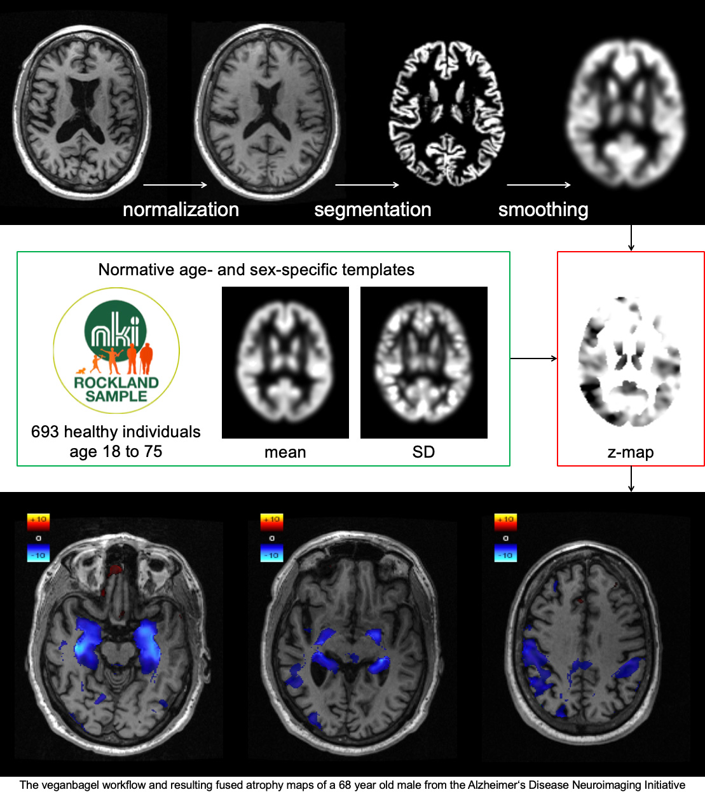

# Brain Imaging Accessoires: Volumetric estimation of gross atrophy and brain age longitudinally (veganbagel)

Estimating regional deviations of brain volume from a patient’s normative age cohort is challenging and entails immense inter-reader variation. We propose an automated workflow for sex- and age-dependent estimation of brain volume changes relative to a normative population.

veganbagel is meant to be used as a submodule of [BrainSTEM](https://github.com/BrainImAccs/BrainSTEM).

Please note, this software is research-only and must not be used for clinical decisions/diagnosis.

# Details

The veganbagel script takes a directory with DICOM files of a non-enhanced 3D T1-weighted structural MR brain scan as input and then generates a map of regional volume changes in relation to an age- and sex-matched cohort of pre-processed normal scans.

Sex- and age-dependent gray-matter (GM) templates based on T1w MRIs of 693 healthy subjects between 16 and 77 years of age from the [Enhanced Nathan Kline Institute - Rockland Sample](http://fcon_1000.projects.nitrc.org/indi/enhanced/) were used. Preprocessing using [CAT12](http://www.neuro.uni-jena.de/cat/) for [SPM12](https://www.fil.ion.ucl.ac.uk/spm/software/spm12/) entailed GM-segmentation, normalization to MNI152, 8 mm smoothing and modulation. For each sex and age between 18 and 75 voxel-wise mean and standard deviation template maps were generated with the respective age +/-2.

These templates can then be used to generate atrophy maps for out-of-sample subjects. Preprocessing is done with the same preprocessing pipeline. Voxel-wise Z-value maps are generated, transformed back into the subject space, colour-coded and merged with the original structural MR brain scan. These volume maps will be automatically exported back to the PACS.



Options to `veganbagel.bash`:

```
 -i --input [arg]    Directory containing the DICOM input files. Required.
 -k --keep-workdir   After running, copy the temporary work directory into the input directory.
 -c --cleanup        After running, empty the source directory (reference DICOM and translation matrices are kept)
 -p --no-pacs        Do not send the results to the PACS.
 -v                  Enable verbose mode, print script as it is executed.
 -d --debug          Enables debug mode.
 -h --help           This page.
```

# Installation

## Requirements

We are listing the software versions we used (likely the latest available during development), but we are currently not aware that we rely on any features that are specific to one of the software's versions.

* [BrainSTEM](https://github.com/BrainImAccs/BrainSTEM)
* [BASH](https://www.gnu.org/software/bash/), we used v4.4.19(1)
* [bc](https://www.gnu.org/software/bc/), we used 1.07.1
* In the current early state: [Git](https://git-scm.com), we used v2.17.1
* [parallel](https://www.gnu.org/software/parallel/), we used v20180822
* [ImageMagick](https://imagemagick.org), we used v7.0.8-11
* [MATLAB](https://de.mathworks.com/products/matlab.html), we used v2018a ([GNU Octave](https://www.gnu.org/software/octave/) is not [quite there, yet](https://en.wikibooks.org/wiki/SPM/Octave), but may be worth a try.)
  * [SPM12](https://www.fil.ion.ucl.ac.uk/spm/software/spm12/)
  * [CAT12](http://www.neuro.uni-jena.de/cat/)

## Installation

veganbagel is in the `modules/` subdirectory of BrainSTEM (after you [initialized and updated the submodules](https://github.com/BrainImAccs/BrainSTEM#installation)).

# Configuration

Copy the setup templates:

```bash
$ cd modules/veganbagel
$ cp setup.veganbagel.bash-template setup.veganbagel.bash
```

Update the path to your SPM12 installation in `setup.veganbagel.bash`:

```bash
# Path to SPM12 install (will be included in $MATLABPATH before executing matlab
#
spm12=/path/to/spm12
```

# Running

Make sure that you [enable veganbagel in BrainSTEM](https://github.com/BrainImAccs/BrainSTEM#assign-jobs-to-queue).

# Debugging

Please see https://github.com/BrainImAccs/BrainSTEM#debugging

# Acknowledgements

The main scripts are based on the [BASH3 Boilerplate](http://bash3boilerplate.sh).
